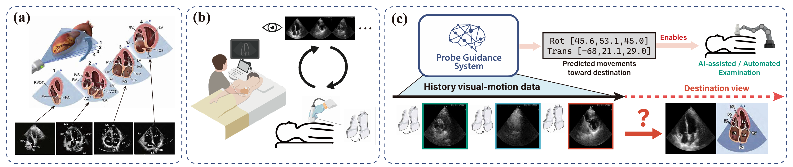
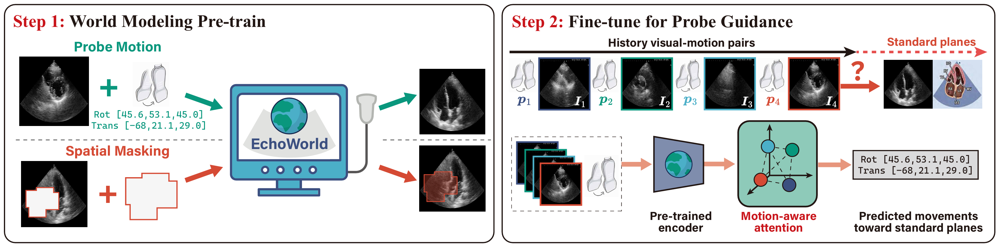

# EchoWorld: Learning Motion-Aware World Models for Echocardiography Probe Guidance (CVPR 2025)
<a href='https://arxiv.org/abs/2504.13065'>

Authors: Yang Yue\*, Yulin Wang\*, Haojun Jiang, Pan Liu, Shiji Song, Gao Huang\#.

\*: Equal contribution, \#: Corresponding author.

## Overview

**Echocardiography probe guidance** helps sonographers capture standard heart views, but requires significant skill and experience. AI-assisted systems aim to automate this process by interpreting ultrasound images and predicting precise probe movements, making cardiac care more accessible and consistent.

**EchoWorld** is a motion-aware world modeling framework that learns both heart anatomy and the visual effects of probe motion. EchoWorld employs a **pre-training** strategy inspired by world modeling principles, where the model predicts masked anatomical regions and simulates the visual outcomes of probe adjustments. Built upon this pre-trained model, we introduce a motion-aware attention mechanism in the **fine-tuning** stage that effectively integrates historical visual-motion data, enabling precise and adaptive probe guidance. Trained on more than one million ultrasound images from over 200 routine scans, our model outperforms existing methods in probe guidance accuracy.

## Acknowledgement

This code is developed on the top of [MAE](https://github.com/facebookresearch/mae) and [I-JEPA](https://github.com/facebookresearch/ijepa)

## Contact

If you have any questions or concerns, please send email to yueyang22@mails.tsinghua.edu.cn

Due to data privacy and institutional restrictions, the dataset used in this study cannot be publicly released.
